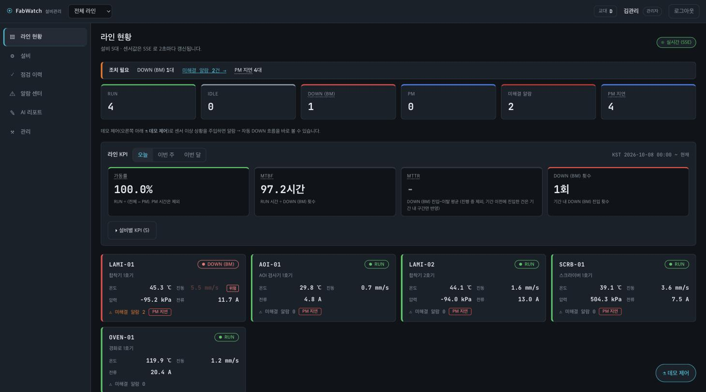
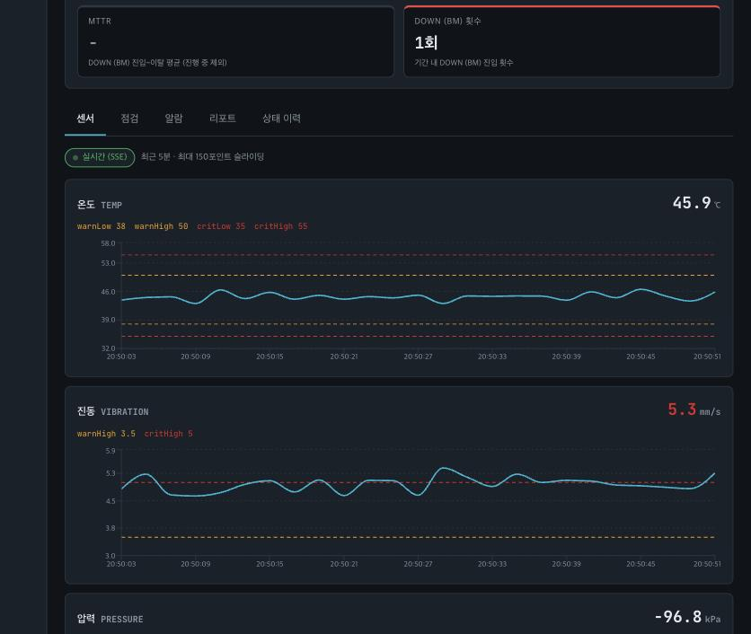
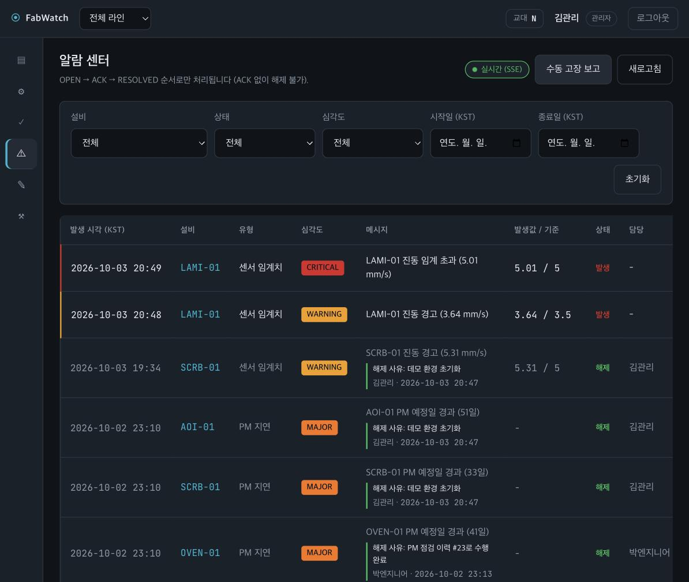
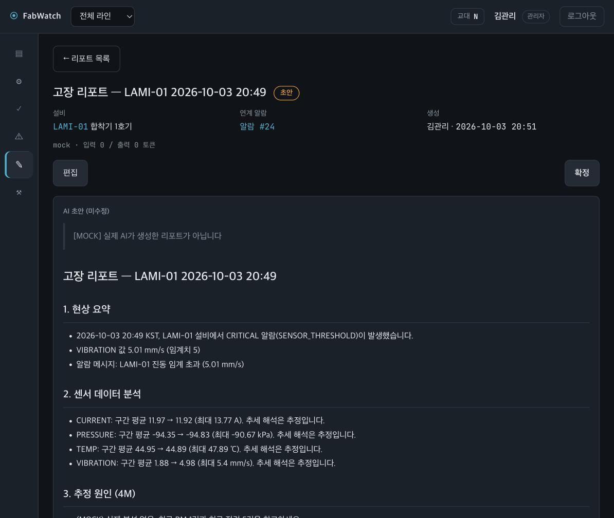
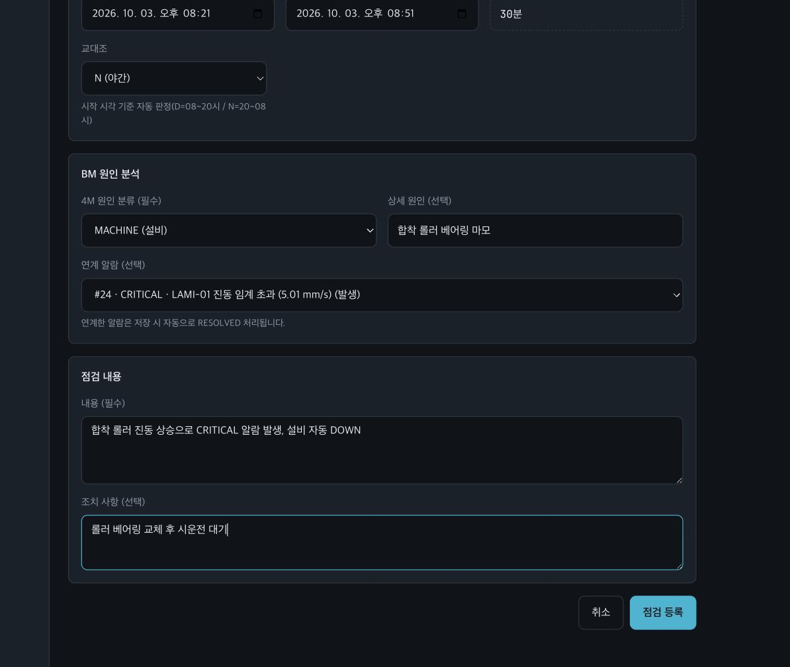
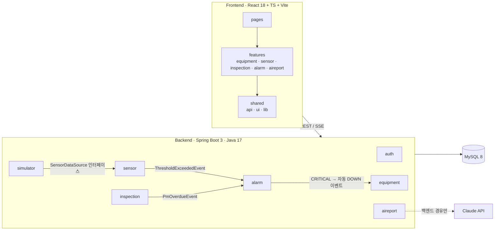

# FabWatch — 설비 점검 이력 · 실시간 모니터링 · AI 고장 리포트

> **생산 테크니션 3년의 현장 경험으로 만든 MES 설비관리 모듈.**
> 보고서 쓰느라 야근하던 테크니션이, 그 보고서를 자동으로 써주는 시스템을 직접 만들었다.

설비 점검 이력(PM/BM) 관리, 센서 실시간 대시보드, 임계치 기반 알람, Claude API를 이용한 고장 리포트 초안 생성을 한 시스템으로 묶은 포트폴리오 프로젝트입니다.
실제 설비 대신 **직접 만든 센서 시뮬레이터**가 고장 전조(드리프트/스파이크/단차)를 재현합니다. 모든 수치·알람 코드·시드 데이터는 **가상값**입니다.

---

## 화면

| | |
|---|---|
| <br>**라인 현황 + KPI** — 설비 상태, 이번 주 가동률/MTBF/MTTR(DOWN 진입~이탈 기준), 미조치 알람 | <br>**센서 실시간 차트** — 임계치 기준선(warn/crit)과 SSE로 들어오는 값. 시뮬레이터 DRIFT가 진동을 임계 부근까지 올린 상태 |
| <br>**알람 센터** — 발생 중 CRITICAL/WARNING, 해제된 알람의 해제 사유·처리자·처리 시각 | <br>**AI 고장 리포트(초안)** — 알람과 센서 1분 집계 추이로 5섹션 초안 생성. *이 캡처는 `AI_PROVIDER=mock` 결과라 `[MOCK]` 표기가 붙어 있음* |
| <br>**BM 점검 등록** — 4M 원인 필수, 연계 알람 선택(저장 시 자동 해제) | |

## 현장 경험 → 기능 매핑

| 현장에서 겪은 것 | FabWatch에 반영한 것 |
|---|---|
| PM(예방정비)/BM(고장정비) 구분, PM 주기 관리 | 점검 유형 분리, PM 스케줄(일/주/월), 지연 경고, 3일 초과 시 MAJOR 알람 자동 생성 |
| 설비 상태 관리 RUN / IDLE / DOWN / PM | 상태 머신(허용된 전이만 가능) + 모든 전이를 이력으로 기록(KPI의 원천) |
| 고장 정지(BM)와 계획 정지(PM)는 통계가 달라야 한다 | DOWN=BM(계획 외 정지)으로 취급, DOWN에서 PM을 거치지 않고 바로 IDLE로 복귀, 사유 필수 |
| 알람이 너무 많으면 진짜 알람을 무시하게 된다 | 동일 설비·센서·심각도의 미해결 알람은 **중복 억제** |
| 인터락(이상 시 가동 중지) | CRITICAL 알람 시 설비 상태 자동 DOWN (DB 상태값만 변경 — 실제 설비 제어 아님) |
| 교대조(주/야) 인수인계 | 점검 이력에 교대조(D 08~20 / N 20~08, KST) 자동 판정 |
| 4M(Man/Machine/Material/Method) 원인 분류 | BM 등록 시 4M 필수 |
| MTBF/MTTR/가동률 | 상태 이력 기반 자동 계산 (일/주/월) |
| 고장 → 조치 → 보고서 작성의 반복 노동 | 알람·센서 추이·최근 이력으로 **AI 고장 리포트 초안** 생성 → 엔지니어 수정 → 확정 |

> 위 표는 포트폴리오의 서사이지 사업적 경쟁 우위를 주장하는 것이 아닙니다. 한계는 아래 [한계와 다음 단계](#한계와-다음-단계) 참고.

## 주요 기능

- **실시간 라인 현황**: 설비 카드, 센서 4종 값, 미조치 알람 수, PM OVERDUE 배지. SSE로 2초마다 갱신(끊기면 3초 폴링으로 폴백)
- **센서 시뮬레이터**: DRIFT(베어링 마모형), SPIKE(순간 과부하), STEP(부품 교체 후 기준선 변화) 주입, 원클릭 데모
- **알람 센터**: OPEN → ACK → RESOLVED 흐름, 해제 사유·처리자 기록, 중복 억제
- **점검 이력**: PM 체크리스트(OK/NG/NA, NG는 엔지니어 확인 대상), BM 4M 분류, 알람 연계 시 자동 해제, 엔지니어 승인
- **AI 고장 리포트**: AI 원본(draft)과 사람이 고친 확정본(final)을 **분리 보관**, 확정 후 수정 불가, 일일 쿼터
- **인증/권한**: JWT(Access 30분 + Refresh 14일), ADMIN / ENGINEER / TECHNICIAN, 로그인 5회 실패 잠금
- **임계치 관리**: 센서별 warn/crit 4값을 ADMIN만 수정(사유 필수, 순서·자릿수 검증, 전부 비우기 차단), 누가·언제·왜·이전→이후가 이력으로 남음

## 아키텍처

**모듈러 모놀리스**입니다(MSA 아님). 도메인별 패키지로 나누고, 도메인 간에는 서비스 인터페이스와 이벤트로만 통신합니다. 근거와 면접 답변은 [docs/10](docs/10_아키텍처결정기록_면접대비.md).



- **도메인 간 직접 참조 금지**: 다른 도메인의 repository/entity를 호출하지 않습니다(FK도 Long ID만 보관).
- **시뮬레이터는 `SensorDataSource` 인터페이스 뒤에** 있어서 실제 PLC/OPC UA 구현체로 교체해도 나머지 코드가 바뀌지 않습니다.
- **Claude 호출은 `aireport` 안에 격리**되어 있고 프론트에서 직접 호출하지 않습니다. 키는 환경변수로만 주입합니다.

| 영역 | 기술 |
|---|---|
| Backend | Spring Boot 3.x, Java 17, Spring Security + JWT, JPA, MySQL 8 |
| Frontend | React 18, TypeScript, Vite, Recharts, react-markdown |
| 실시간 | SSE (단방향 푸시라 WebSocket 불필요) + 폴링 폴백 |
| AI | Claude API (`claude-sonnet-5-5`), 비동기 생성(202 + 폴링) |
| 테스트 | JUnit 5, MockMvc, H2(MySQL 모드) — 백엔드 570개+, 프론트 60개+ |

## 실행 방법

필요: Docker, Java 17, Node 18+

```bash
# 1) DB (MySQL 8, 호스트 포트 3307)
docker compose up -d

# 2) 백엔드 (http://localhost:8080)
cd backend
AI_PROVIDER=mock ./gradlew bootRun      # 실제 Claude 호출 없이 전체 흐름 확인
# 실제 호출: ANTHROPIC_API_KEY 설정 후 AI_PROVIDER=claude (기본값)

# 3) 프론트 (http://localhost:5173)
cd frontend
npm install
npm run dev
```

환경변수 이름은 [`.env.example`](.env.example), 전체 표는 [docs/13](docs/13_배포운영명세서.md)에 있습니다. 비밀값은 `.env`/환경변수로만 주입하고 커밋하지 않습니다.

**데모 계정(로컬 시드 전용, 가상 계정)** — 비밀번호는 시드 코드(`LocalDataSeeder`)에 있고, 개발 모드의 로그인 화면에는 '데모 계정' 버튼이 있습니다(운영 빌드에서는 `VITE_DEMO_LOGIN=false`가 기본이라 계정 정보가 노출되지 않습니다).

| 역할 | ID | 할 수 있는 것 |
|---|---|---|
| ADMIN | `admin@fabwatch.dev` | 전부 |
| ENGINEER | `engineer@fabwatch.dev` | 상태 변경, AI 리포트 생성/확정, 승인 |
| TECHNICIAN | `tech@fabwatch.dev` | 점검 등록, 알람 처리, DOWN → IDLE 복귀 |

> `AI_PROVIDER=mock`은 명시적으로 켰을 때만 동작하고, 결과 맨 위에 `[MOCK] 실제 AI가 생성한 리포트가 아닙니다`가 항상 붙습니다. 키가 없다고 자동으로 mock으로 바뀌지 않습니다(키 없음 → FAILED + 사유 표시).

## 3분 시연 시나리오

1. **로그인**(admin) → *라인 현황*: 설비 5대의 센서 값이 2초마다 갱신됩니다.
2. 우측 하단 **데모 제어 → 데모 자동 시작**: 한 설비의 진동 센서에 2분짜리 DRIFT(서서히 상승)가 걸립니다.
3. 설비 상세의 **센서 차트**가 오르고, **WARNING → CRITICAL** 알람이 뜬 뒤 설비가 **자동 DOWN**됩니다.
4. *알람 센터*에서 CRITICAL 알람의 **AI 리포트** 버튼 → 생성 중 화면 → 초안(DRAFT).
5. 리포트를 **편집**(원본 초안은 읽기 전용으로 보존) → **확정**. 확정 후에는 수정할 수 없습니다.
6. *점검 이력 → 등록*: **BM**(4M 원인 필수) + 연계 알람 선택 → 저장하면 알람이 자동 해제되고, 설비가 DOWN이면 **IDLE 전환 확인창**이 뜹니다(자동 전환 없음 — 시운전 확인 후 전환하는 현장 원칙).
7. 설비 상세의 **KPI**(가동률/MTBF/MTTR)에서 방금 고장이 반영된 것을 확인합니다.

## 테스트

```bash
cd backend && ./gradlew test        # 단위 + 통합 (외부 네트워크 호출 없음, H2)
cd frontend && npm run build && npm run lint
```

핵심 도메인 4종(임계치 판정 / PM 일정 계산 / KPI 계산 / 상태 머신)은 경계값 위주의 단위 테스트가 있습니다. 시각은 UTC 저장·KST 표시이고 교대 판정은 KST 경계값을 테스트합니다.

## 트러블슈팅

| 문제 | 원인 | 해결 / 배운 것 |
|---|---|---|
| H2 테스트는 전부 통과했는데 **MySQL 첫 기동에서 시드 삽입 실패** | `@Lob` 컬럼에 length를 안 주면 Hibernate가 255로 잡아 MySQL에서 `tinytext`가 생성됨(H2는 통과) | 컬럼 길이를 명시해 TEXT/MEDIUMTEXT로 생성. **테스트 DB와 운영 DB가 다르면 실기동 검증을 따로 해야 한다** |
| 테스트가 **간헐적으로 로그인 401** (실행 순서에 따라 25건이 실패했다가 재현 안 됨) | 여러 Spring 테스트 컨텍스트가 같은 H2 인메모리 DB를 공유하고 `create-drop`이라, 새 컨텍스트가 뜰 때 다른 컨텍스트의 스키마·데이터가 삭제됨. 새 테스트 파일이 추가되며 실행 순서가 바뀌어 처음 드러남 | 컨텍스트마다 고유 DB URL(`jdbc:h2:mem:${random.uuid}`)로 격리, 전체 스위트 3회 연속 통과로 확인. **재현 안 되는 실패도 원인을 끝까지 추적한다** |
| AI 리포트가 **빈 본문 또는 중간에 잘릴 위험** | 사용 모델이 thinking 기본 ON이라 사고 토큰이 `max_tokens`에 포함됨(2000으론 부족) | 모델 사양 문서로 확인 후 effort `low` + `max_tokens` 4096 + 읽기 타임아웃 60초, 잘림/빈 본문을 호출 로그에서 구분. **LLM 파라미터는 "원래 되던 값"을 믿지 말고 모델별 사양으로 확인한다** |
| **PM 점검을 했는데 PM 지연 알람이 계속 남음** | PM 등록이 스케줄은 갱신했지만 이미 생성된 지연 알람은 그대로 둠(실서버 시연 중 발견) | PM 등록 시 같은 설비의 미해결 PM 지연 알람을 같은 트랜잭션에서 자동 해소 |
| DRIFT 시나리오를 안 끄면 **온도가 1721℃까지 상승** | 기울기 × 경과시간이 상한 없이 증가 | 목표값(임계 도달값)에서 고정되게 상한 추가 |
| 상태 머신이 현장과 맞지 않음 | 고장(DOWN)을 PM으로 바꿔야만 정비 가능 → 고장 수리가 PM 통계에 섞이고 실적에도 예민 | DOWN을 BM으로 정의, DOWN → IDLE/RUN 직행 허용(사유 필수, 권한 분리), MTTR 정의도 함께 수정 |

## 보안 / 데이터 원칙

- API 키·비밀번호는 환경변수만 사용, Git에 커밋하지 않음. 로그·에러 메시지·DB 어디에도 키를 남기지 않음
- AI 프롬프트에 알람·점검 자유텍스트를 넣을 때는 **데이터로 격리**하고(프롬프트 인젝션 방어), 작업자 이름·이메일 같은 개인정보는 넣지 않음. AI 출력 마크다운은 raw HTML·`javascript:`·이미지를 렌더링하지 않음
- **실제 LG디스플레이 공정 수치·알람 코드·레시피는 사용하지 않음.** 시드는 전부 가상값
- 삭제는 soft delete, 에러 응답은 `{code, message, timestamp}`로 통일

## 한계와 다음 단계

- **설비 상태 DOWN은 DB 값일 뿐 물리적 설비 제어가 아닙니다.** 실제 설비를 제어하는 인터락으로 확장하려면 기능안전(IEC 61508 등) 검토가 선행되어야 합니다.
- 센서는 시뮬레이터입니다. `SensorDataSource` 구현체를 PLC/OPC UA로 교체하는 것이 다음 단계입니다.
- 상태 머신 + CRUD + AI 리포트는 숙련 개발자가 단기간에 복제할 수 있는 구조입니다. 이 프로젝트의 차별점은 사업적 해자가 아니라 **현장 도메인 지식이 기능에 반영된 정도**입니다.
- 단일 인스턴스 전제(SSE 브로드캐스터, AI 쿼터 락)입니다. 확장 시 외부 브로커/분산 락이 필요합니다(`// SCALE:` 주석으로 표시).
- 멀티테넌시는 설계만 했고(`// TENANT:` 주석 지점) 구현하지 않았습니다.
- 교대 인수인계 요약(AI)과 관리자용 사용자 등록/비활성화 화면은 미구현입니다. 실제 Claude 호출은 API 키 준비 후 별도 검증이 필요합니다(지금까지는 mock으로 전체 흐름만 검증).

## 문서

기획·명세는 [`docs/`](docs/00_README_문서활용가이드.md)에 있습니다: 서비스 기획(01) · 요구사항(02) · 기능(03) · 화면(04) · DB(05) · API(06) · 로드맵(07) · 아키텍처 결정/면접 대비(10) · 보안(11) · 테스트(12) · 배포(13) · 용어(14) · 성능(15).
